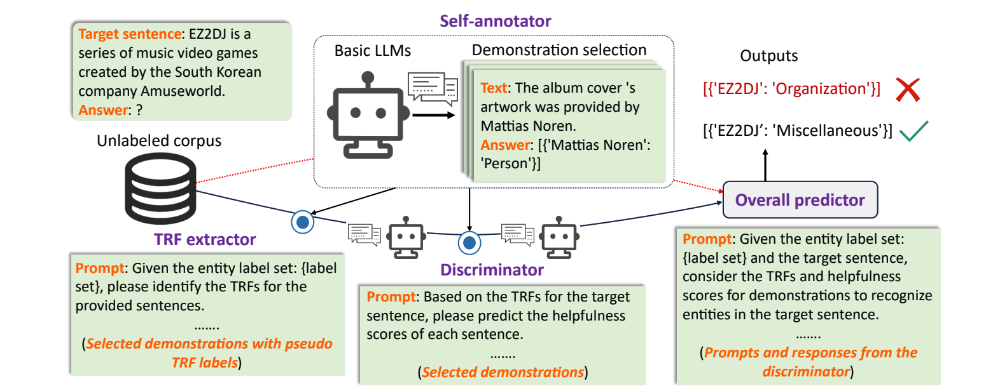

# A Cooperative Multi-Agent Framework for Zero-Shot Named Entity Recognition

Source code for our paper accepted at the ACM WWW conference: [A Cooperative Multi-Agent Framework for Zero-Shot Named Entity Recognition](https://dl.acm.org/doi/pdf/10.1145/3696410.3714923). Our implementation is base on [Self-Improving for Zero-Shot Named Entity Recognition with Large Language Models](https://github.com/Emma1066/Self-Improve-Zero-Shot-NER). 

## Introduction
Inspired by the demonstrated complex problem-solving capabilities of multi-agent approaches, in this paper, we present a framework, named the <ins>C</ins>ooperative <ins>M</ins>ulti-<ins>A</ins>gent <ins>S</ins>ystem (CMAS) for zero-shot NER, harnessing the collective intelligence of LLM-based agents.



We aim to address two challenging problems:

- Challenge 1: Overlooking correlations between contexts surrounding entities.
- Challenge 2: Indiscriminate use of task demonstrations.

To tackle the first issue, we propose redefining the traditional NER task into two subtasks: recognizing named entities and identifying entity type-related features (TRFs, i.e., tokens strongly associated with entity types). To address the second problem, we incorporate a self-reflection mechanism, enabling LLMs to reflect on the helpfulness of retrieved demonstrations and selectively learn from them.
 
## Prepare the data
1. See data/README.md

2. Run the followings commands to Extract trf and embedding
```shell
python extract_trf.py --dataset_name <dataset_name>
python get_trf_embd.py
```

## Run
### 1. Set your <api-key> and <base-url> in code/const.py

### 2. Run the followings commands

```shell
# Self-annotator for unlabelled data
sh scripts/wikigold_1_self_annotate_TSMV.sh
sh scripts/wikigold_2_entity_level_sel.sh
sh scripts/wikigold_2_sample_level_sel.sh
# Helpfulness-based prediction
sh scripts/wikigold_3_test_inference_helpfulness.sh
# Trf-based prediction
sh scripts/wikigold_3_test_inference_trf.sh
# Get performance on overall prediction
sh scripts/wikigold_3_test_get_results.sh
```

